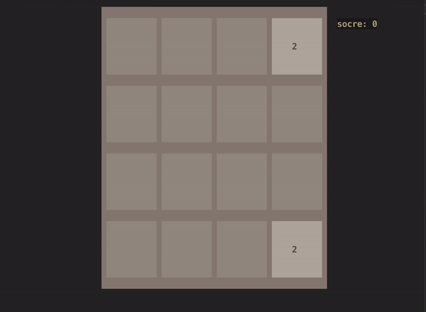

# TUI 2048 Game

Implemented in Java



### Compatibility

only tested in MacOs

## How to Run

build from source

```shell
git clone https://github.com/2012monk/term2048.git
cd term2048
gradle build
mv build/distributions/term2048.tar .
```

or download distribution file

unzip distribution file

```shell
uzip term2048.zip
# or
# tar xzf term2048.tar
```

run

```shell
cd term2048/bin
./term2048
```
